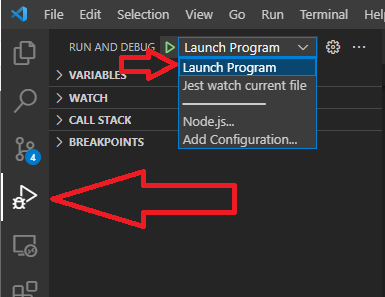

# Building and debugging the App

## Prepare the system

- Install [VSCode](https://code.visualstudio.com/)
- Install [node.js](https://nodejs.org/en/download/)
- Install yarn:

        npm install --global yarn

## Build

1.  Clone this repo:

        git clone https://github.com/waytrade/ib-api-service.git
        cd ib-api-service

2.  Create a `.npmrc` file on root folder.\
    `@waytrade` packages are not hosted on **npm.js but on github**.\
    Since Github does not allow unauthenticated access, you first need to create personal access on https://github.com/settings/tokens (make sure `read:packages` is checked!) and paste it into a .npmrc file with the following content:

            @waytrade:registry=https://npm.pkg.github.com
            //npm.pkg.github.com/:_authToken=<yourPersonalAcessToken>

3.  Install dependencies:

        yarn install

4.  Start IBGateway App locally and adapt IB_GATEWAY_PORT on `config/development.json` if needed.

5.  Open the root folder on on VSCode:

        code .

6.  Switch to `Run and Debug` tab, select `Launch Program`

7.  Press Ctrl+Shit+B to start the auto-build (will automatically rebuild if code changes)

8.  Press F5 to start the App on debugger.
