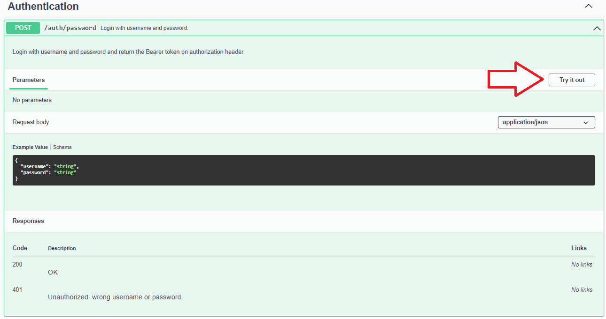
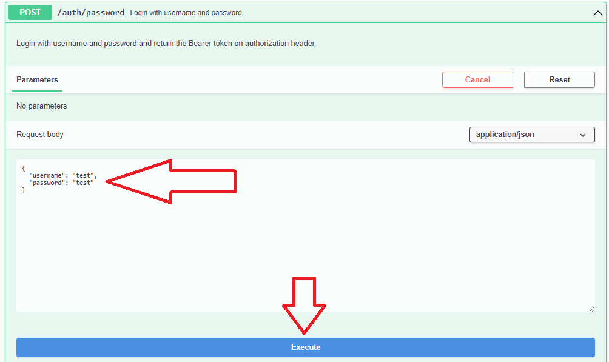
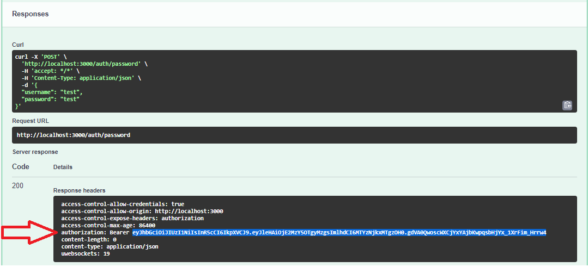
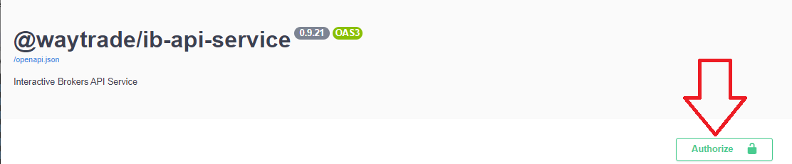
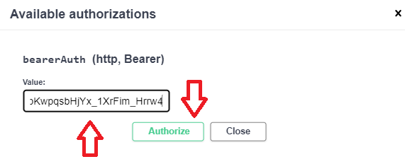

# How to authenticate on SwaggerUI

1. Open SwaggerUI on your browser (e.g. http://localhost:3000), expand the Authentication endpoint and click `Try it out`:

2. Edit the request body to contain the REST_API_USERNAME / REST_API_PASSWORD credentials from the .env file and click on `Execute`.

3. Find the authorization header on response and copy the JWT token (that is everything after 'Bearer '):

4. Scroll to top of page and click the `Authorize` button:

5. Paste the JWT token from step 3, click `Authorize` and `Close`.

\
You are now authenticated and can use other API endpoints without getting error 401.
